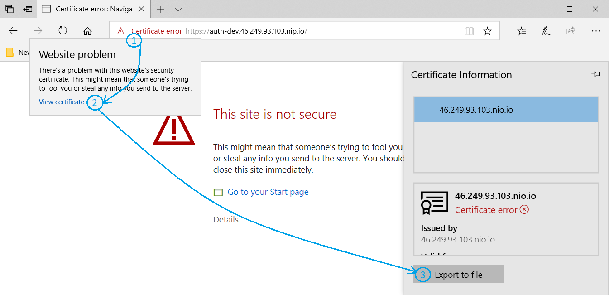

# Deployment Setup Memo
Authenticator is deployed on an OpenShift environment. The "s2i-spring-boot-camel" template is applied with:
 
    APP_NAME=auth-dev
    GIT_REPO=https://github.com/ProjectZeroOrg/Authenticator.git
    GIT_REF=dev
    MAVEN_ARGS_APPEND=-pl auth-web -am
    ARTIFACT_DIR=auth-web/target

The default values are used for the rest of the options.

## TSL certificate
The certificate is generated using steps from this guide https://www.akadia.com/services/ssh_test_certificate.html:
```
openssl genrsa -des3 -out server.key 1024
openssl req -new -key server.key -out server.csr
cp server.key server.key.org
openssl rsa -in server.key.org -out server.key
openssl x509 -req -days 365 -in server.csr -signkey server.key -out server.crt
```

## Expose the service
The auth-dev service is created with the following command.
```
oc expose dc auth-dev --type=LoadBalancer --name=auth-dev --port=8080 -n=project-zero
```
Then a Secure route is created for the service with the server.crt and server.key

## Importing the certificate to the trusted JDK store
In order for the other applications (the extras) to work in local development environment, they need to trust the self-signed certificate.
This is achieved by importing the certificate to the JDK store. First the certificate is exported using the Edge browser.


Then the exported certificate is imported to the trusted JDK store:
```
cd \devtools\jdk8\bin
keytool -import -alias auth-dev -keystore \devtools\jdk8\jre\lib\security\cacerts -file \Users\ilian\https3\4624993103nioio.crt
```
    